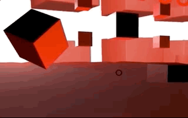

# Red-Cube-Escape
- **A-frame based Room Escape Game**
- **Web VR Room Escape Game**


* [Intro](#intro)
  + [Installation](#installation)
* [Walk Through](#walk-through)
  + [1. Layout](#1-layout)
  + [2. Cursor & mouse](#2-cursor---mouse)
  + [3. Riddle](#3-riddle)
    - [3.1 Riddle Line1: Under the Ocean](#31-riddle-line1--under-the-ocean)
    - [3.2  Riddle Line2: Worship the Moonlight](#32--riddle-line2--worship-the-moonlight)
    - [3.3  Riddle Line3: Fight in the Space](#33--riddle-line3--fight-in-the-space)
* [Bugs](#bugs)

## Intro

This game is based on A-Frame, because it is easy to use. 

> A-Fram can be developed from a plain HTML file without having to install anything. 

Aframe version: 1.0.4

Live Red-Cube-Escape Game: [Link](https://xiaoyu-lu.github.io/Red-Cube-Escape/escape-red.html)

Tested on: Safari|Google Chrome|Safari Mobile | Chrome Mobile

Developer:

| <br/>[Xiaoyu Lu](https://github.com/Xiaoyu-Lu) |
| ------------------------------------------------------------ |

Date : 2020/11/26

### Installation

- Download the code.

  Code Structure:

  ```
  .
  ├── assets
  │   ├── alien.gltf (gltf model created by blender)
  │   ├── cubes-red.jpg (360-degree panorama)
  │   ├── night-red.jpg (360-degree panorama)
  │   ├── space.jpg (360-degree panorama)
  │   └── stone.jpg (material for the moon)
  ├── escape-red.html (initial scene)
  ├── escape-space.html  (next/end scene)
  └── libs
      ├── aframe-animation-component.min.js
      ├── aframe-event-set-component.min.js
      ├── aframe-extras.min.js
      ├── aframe-extras.ocean.min.js
      ├── aframe-particle-system-component.min.js
      ├── aframe-physics-system.min.js
      ├── aframe-proxy-event-component.min.js
      ├── aframe-template-component.min.js
      ├── aframe-text-geometry-component.min.js
      ├── aframe.min.js
      └── link-controls.js
  ```

- Online editor:

  - keep: assets & .html & link-controls.js

  - Remix on *Glitch* 

    > [Glitch](https://glitch.com/~aframe) provides an online code editor with instant deployment and hosting of web sites. The editor supports both front-end and back-end code as well as multiple files and directories. Glitch lets us remix (i.e., copy) existing projects and make them our own and instantly host and deploy changes for everyone to see.

  - Remix on CodePen

    > [CodePen — A-Frame](https://codepen.io/mozvr/pen/BjygdO)

  ##### N.B.: If you choose to remix on the online code editors, you might have to change some paths.

  1. Scripts. e.g. from `<script src="libs/aframe.min.js"></script>` to `<script src="https://aframe.io/releases/1.0.4/aframe.min.js"></script>`

     Below are the scripts (version included) you might have to change to:
  
     ```html
      <script src="https://aframe.io/releases/1.0.4/aframe.min.js"></script>
      <script src="https://cdn.jsdelivr.net/gh/donmccurdy/aframe-extras@v6.1.1/dist/aframe-extras.min.js"></script>
      <script src="https://unpkg.com/aframe-physics-system@1.4.0/dist/aframe-physics-system.min.js"></script>
      <script src="https://unpkg.com/aframe-animation-component@3.2.5/dist/aframe-animation-component.min.js"></script>
      <script src="https://unpkg.com/aframe-extras.ocean@%5E3.5.x/dist/aframe-extras.ocean.min.js"></script>
      <script src="https://unpkg.com/aframe-event-set-component@5/dist/aframe-event-set-component.min.js"></script>
      <script src="https://unpkg.com/aframe-template-component@3.2.1/dist/aframe-template-component.min.js"></script>
      <script src="https://unpkg.com/aframe-proxy-event-component@2.1.0/dist/aframe-proxy-event-component.min.js"></script>
      <script src="https://unpkg.com/aframe-text-geometry-component@^0.5.0/dist/aframe-text-geometry-component.min.js"></script>
      <script src="https://unpkg.com/aframe-particle-system-component@1.0.x/dist/aframe-particle-system-component.min.js"></script>
     ```
  
  2. Assets. You might need to change the path of assets. For Glitch, you can upload assets, copy the URL, and use it in the code.
  
     

## Walk Through

The scene is inspired by a science-fiction horror movie called Cube. The mission of the player is to escape from the cube/room. 

### 1. Layout

If you click the big cube in the middle, the room will go red for a second, and the cube rotates itself. With those floating cube,  two light entities in the room (i.e., two animated rotating spheres) provides a weird atmosphere to the scene. 


### 2. Cursor & mouse

If the object is clickable, the color of the cursor will change from black to yellow. 


When the mouse(i.e., a hand icon in PC) hovering over some clickable/unclickable objects, they might disappear or change colors/scale.



### 3. Riddle

Randomly click a floating cube, a hidden riddle might show up. There are three lines; each refers to a clue.


#### 3.1 Riddle Line1: Under the Ocean

On the ocean, a yellow cylinder flows up and down. When your mouse hovers over it, a prompt said: "See through Sea". Click it. You could see everything "under the ocean". The first line solved!


 Let's check the second line. It told you to "worship MOONLIGHT". Considering that the moonlight only exists at night, you probably need the night scene and a moon.  

#### 3.2  Riddle Line2: Worship the Moonlight

Let's find the mystery "under the ocean"! 

While investigating those cubes,  you find a cube changed its color to blue with a "Night is coming" prompt. It must be something important. Click it. The sky suddenly becomes dark. 


You look around and see the moon swirling. You rush to it to see closer. It becomes larger when you mouse hovering above it. 


There's no harm to click it, it won't explode. And a Portal with a text "Space" appears in the sky. 


Let's go through the portal "Space"!

#### 3.3  Riddle Line3: Fight in the Space

Something is emitting out of the giant celestial object. An alien is approaching. What should you do? Stand still?


Again, there's no harm to click the alien, it won't kill you. 


A revised quote of Oscar Wilde shows up in the middle of nowhere:

*“Some of us are looking at the stars, but all of us are all in the gutter.”* 

> " We are all in the gutter, but *some of us are looking at the stars*.” - Oscar Wilde

Of course, this esoteric clue is not hard for you. 

(Look up, nothing!)

Look down, a Portal to another room!

Yes, you did it! Congrats!

## Bugs

There're two identified bugs. 

1. The ocean should be impenetrable.
2. Some properties of the hidden object should be removed (e.g. the hidden portal shouldn't be functional).

